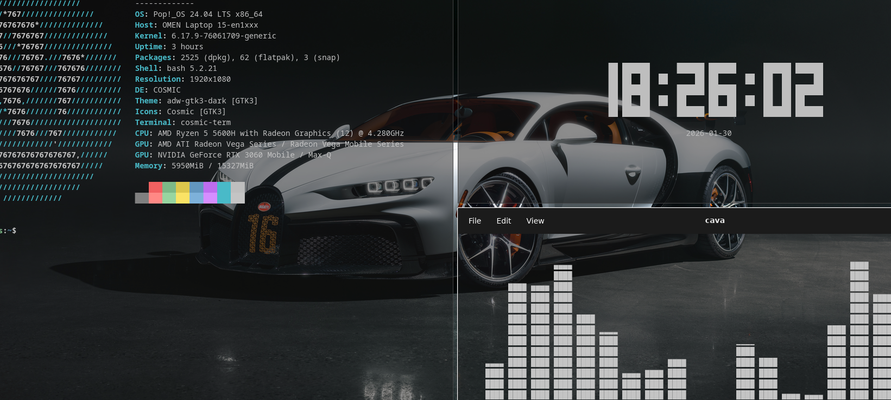

# 💻 Cybersecurity Engineering Student & Software Developer

I'm passionate about exploring **network security, ethical hacking, and software development**. I love turning **complex problems** into **clear** and **effective solutions.**  

- Currently focused on **developing personal projects and conducting hands-on security labs**  
- Actively enhancing skills in **advanced network security and penetration testing**  
- I enjoy **strategic** and **role-playing games** that emphasize **problem-solving, planning, and persistence.** 
- **Portfolio Website:** [jaafar-trabelsi.netlify.app](https://jaafar-trabelsi.netlify.app/)

---

### 🛠 Tech Stack

| Category | Tools & Languages |
| :--- | :--- |
| **Programming Languages** |    |
| **Web Development** |    |
| **Scripting & Automation** |  |
| **Databases** |   |
| **Networking & Security** |     |
| **Operating Systems & Tools** |    |
| **Version Control** |   |

---

### 🖥️ Development Environment

**Daily Driver:**   
**Security Testing:**  VM via QEMU  
**Virtualization:**  for isolated security labs and testing environments  
*Also experienced with other virtualization solutions for diverse environments*

---

### 📬 Connect with Me

---
